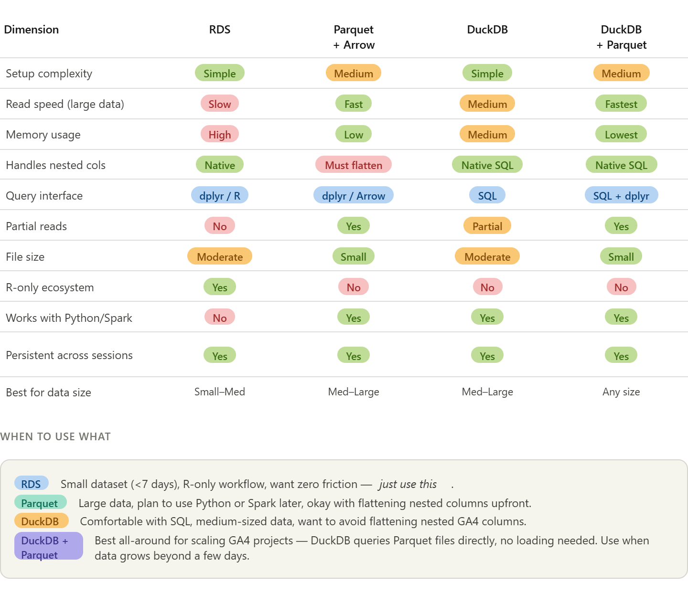
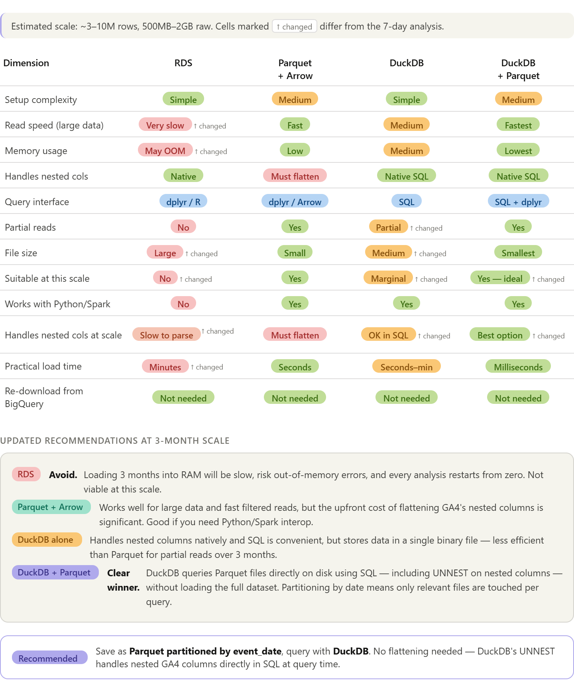

# Comparisoon of Various Methods

## Small GA4 Project (\< 7 days)

For your current 7-day project, **RDS alone is enough**. As you scale up or start wanting SQL-style queries, **DuckDB + Parquet** is the most powerful pairing — DuckDB queries the Parquet files directly without even needing to load them first.



### A few things worth highlighting from the table:

**The nested column problem is the deciding factor for GA4 specifically.** RDS and DuckDB both handle `event_params`, `device`, and `geo` as-is, while raw Parquet forces you to flatten them first (which is where all that `purrr` complexity came from).

**DuckDB + Parquet is the best long-term investment** because DuckDB can query Parquet files on disk directly with a single line — `duckdb::duckdb_read_csv()` or `FROM read_parquet('data/*.parquet')` — meaning you get the storage efficiency of Parquet without writing Arrow query pipelines.

**For your current 7-day project**, RDS wins on simplicity. But if you plan to scale to months of GA4 data, switching to DuckDB early costs very little effort and will save you a lot of pain later.

## Large GA4 Data (90 days)



### The three key shifts from the 7-day analysis are:

**RDS is now off the table.** At 3 months, you're likely looking at 3–10M rows and 500MB–2GB of raw data. Loading that entirely into RAM on every session is slow, risks crashing R with an out-of-memory error, and gives you no ability to query just a slice of the data.

**DuckDB alone becomes marginal.** A `.duckdb` file is a single binary blob — you can't selectively read January without touching February and March. It's fine for medium data but loses its edge at this scale.

**DuckDB + Parquet is the clear winner**, and the setup is simpler than it sounds. You save once as date-partitioned Parquet files, then DuckDB reads them directly on disk:

```{{r}}
library(duckdb)
con <- dbConnect(duckdb())

# DuckDB reads Parquet files directly — no loading into R first
dbGetQuery(con, "
  SELECT
    event_date,
    event_name,
    ep.value.string_value AS page_location
  FROM read_parquet('data/ga4_parquet/**/*.parquet', hive_partitioning = true)
  CROSS JOIN UNNEST(event_params) AS ep(key, value)
  WHERE event_date BETWEEN '20210101' AND '20210131'
    AND ep.key = 'page_location'
")
```

::: callout-important
Three things make this powerful at your scale: the `hive_partitioning = true` flag means DuckDB skips entire month folders when your `WHERE` clause doesn't need them; `UNNEST` handles the nested GA4 columns without any upfront flattening; and nothing is loaded into R memory until `dbGetQuery()` returns the final filtered result.
:::

# Recommended Workflow for Large GA4 Data

-   Will use DuckDB + Parquet

## Step 1: Install packages

```{{r}}
install.packages(c("bigrquery", "duckdb", "arrow", "dplyr"))
```

## Step 2: Download from BigQuery once, save as partitioned Parquet

Do this **once only**. All future analysis reads from local Parquet files.

```{{r}}
library(bigrquery)
library(arrow)
library(dplyr)

billing_project <- "your-project-id"

# Download in monthly chunks to avoid memory pressure
months <- list(
  c("20210101", "20210131"),
  c("20210201", "20210228"),
  c("20210301", "20210331")
)

dir.create("data/ga4_parquet", recursive = TRUE, showWarnings = FALSE)

for (m in months) {
  message("Downloading ", m[1], " to ", m[2], "...")
  
  result <- bq_project_query(billing_project, glue::glue("
    SELECT
      event_date, event_timestamp, event_name,
      event_params, user_pseudo_id,
      device, geo, traffic_source, ecommerce, items
    FROM `bigquery-public-data.ga4_obfuscated_sample_ecommerce.events_*`
    WHERE _TABLE_SUFFIX BETWEEN '{m[1]}' AND '{m[2]}'
  "))
  
  chunk <- bq_table_download(result, bigint = "numeric", page_size = 1000)
  
  # Write directly to partitioned Parquet — Arrow infers event_date partition
  chunk |>
    group_by(event_date) |>
    write_dataset("data/ga4_parquet", format = "parquet")
  
  rm(chunk); gc()  # free memory between chunks
}
```

-   Your folder structure will look like:

```         
data/ga4_parquet/
  event_date=20210101/part-0.parquet
  event_date=20210102/part-0.parquet
  ...
```

## Step 3: Connect DuckDB to the Parquet files

At the start of every future session, just run this — no re-downloading, no loading into RAM:

```{{r}}
library(duckdb)
library(DBI)

con <- dbConnect(duckdb())

# Register the entire partitioned dataset as a virtual table
dbExecute(con, "
  CREATE VIEW ga4 AS
  SELECT * FROM read_parquet(
    'data/ga4_parquet/**/*.parquet',
    hive_partitioning = true
  )
")
```

From here, `ga4` behaves like a database table. DuckDB reads only the Parquet partitions your query needs.

## Step 4: Query as needed

**Flat columns — standard SQL:**

```{{r}}
# Only touches January partitions on disk
dbGetQuery(con, "
  SELECT event_date, event_name, COUNT(*) AS n
  FROM ga4
  WHERE event_date BETWEEN '20210101' AND '20210131'
  GROUP BY 1, 2
  ORDER BY 3 DESC
")
```

**Nested columns — use UNNEST in SQL:**

```{{r}}
# Extract page_location from event_params without any upfront flattening
dbGetQuery(con, "
  SELECT
    event_date,
    user_pseudo_id,
    ep.value.string_value AS page_location
  FROM ga4
  CROSS JOIN UNNEST(event_params) AS ep(key, value)
  WHERE event_name = 'page_view'
    AND ep.key = 'page_location'
    AND event_date BETWEEN '20210101' AND '20210131'
")
```

**Device and geo nested fields:**

```{{r}}
dbGetQuery(con, "
  SELECT
    device.category AS device_type,
    device.operating_system AS os,
    geo.country,
    geo.city,
    COUNT(DISTINCT user_pseudo_id) AS users
  FROM ga4
  WHERE event_date BETWEEN '20210101' AND '20210331'
  GROUP BY 1, 2, 3, 4
  ORDER BY 5 DESC
")
```

**Purchase funnel — joining unnested params:**

```{{r}}
dbGetQuery(con, "
  SELECT
    event_name,
    COUNT(DISTINCT user_pseudo_id) AS users,
    COUNT(*)                        AS events
  FROM ga4
  WHERE event_name IN ('session_start','view_item','add_to_cart','purchase')
    AND event_date BETWEEN '20210101' AND '20210331'
  GROUP BY 1
  ORDER BY 3 DESC
")

```

## Step 5: Close the connection when done

```{{r}}
dbDisconnect(con)
```
